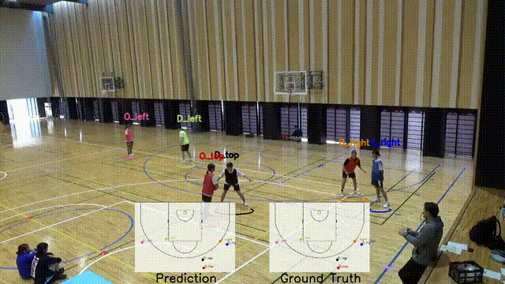

# TrackID3x3
> ⚠️ **Note:** This research project is a work in progress. Both this repository and the corresponding [arXiv paper](https://arxiv.org/abs/2503.18282) are subject to updates and improvements over time.

## TrackID3x3 dataset 

The dataset consists of three subsets: Indoor, captured by indoor fixed cameras; Outdoor, captured by outdoor fixed cameras; and Drone, captured by outdoor drone cameras.
The video has bounding boxes of on-court players for all frames and 10 posture keypoints of each player for some frames only.

<!-- GIF EMBEDS START -->


<!-- GIF EMBEDS END -->

## Track-ID task
This task is the Game State Reconstruction task for fixed camera videos, manually performing the subtask of court localization. 

<!-- GIF EMBEDS START -->


<!-- GIF EMBEDS END -->

## Citation

If you use this repository for your research or wish to refer to our contributions, please cite the following paper:

[**TrackID3x3: A Dataset for 3x3 Basketball Player Tracking and Identification**](https://arxiv.org/abs/2503.18282)

```bibtex
@article{yamada2025trackid3x3,
  title={TrackID3x3: A Dataset for 3x3 Basketball Player Tracking and Identification},
  author={Yamada, Kazuhiro and Yin, Li and Hu, Qingrui and Ding, Ning and Iwashita, Shunsuke and Ichikawa, Jun and Kotani, Kiwamu and Yeung, Calvin and Fujii, Keisuke},
  journal={arXiv preprint arXiv:2503.18282},
  year={2025}
}
```


